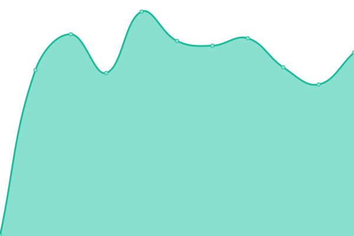
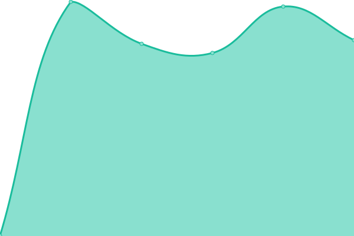
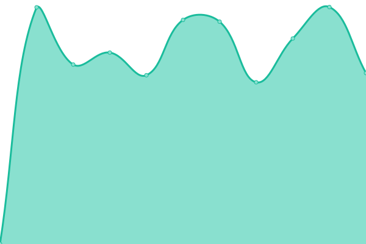

# [📈 Live Status](https://dhduc.github.io/uptime) <!--live status--> **🟩 All systems operational**

<!--start: status pages-->
<!-- This summary is generated by Upptime (https://github.com/upptime/upptime) -->
<!-- Do not edit this manually, your changes will be overwritten -->

| URL                                  | Status | History                                                                                 | Response Time                                                                   | Uptime                                                                                                                                                                                              |
| ------------------------------------ | ------ | --------------------------------------------------------------------------------------- | ------------------------------------------------------------------------------- | --------------------------------------------------------------------------------------------------------------------------------------------------------------------------------------------------- |
| [Homepage](https://ducdh.com)        | 🟩 Up  | [homepage.yml](https://github.com/dhduc/uptime/commits/master/history/homepage.yml)     |  1511ms  |      |
| [Engo Pro](http://engo.pro)          | 🟩 Up  | [engo-pro.yml](https://github.com/dhduc/uptime/commits/master/history/engo-pro.yml)     |  695ms   |       |
| [Top Mobile](https://topmobile.site) | 🟩 Up  | [top-mobile.yml](https://github.com/dhduc/uptime/commits/master/history/top-mobile.yml) |  789ms |  |
| [Savid Top](https://savid.top)       | 🟩 Up  | [savid-top.yml](https://github.com/dhduc/uptime/commits/master/history/savid-top.yml)   |  1622ms |    |

<!--end: status pages-->

[**Visit our status website →**](https://dhduc.github.io/uptime)

## 📄 License

- Code: [MIT](./LICENSE) © [Duc Dao](https://ducdh.com)
- Data in the `./history` directory: [Open Database License](https://opendatacommons.org/licenses/odbl/1-0/)
- Powered by [Upptime](https://github.com/upptime/upptime).
