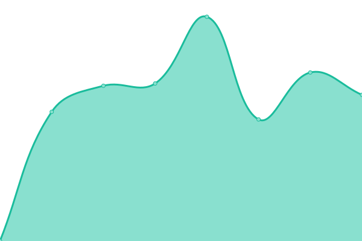

# [📈 Live Status](https://dhduc.github.io/uptime) <!--live status--> **🟩 All systems operational**

<!--start: status pages-->
<!-- This summary is generated by Upptime (https://github.com/upptime/upptime) -->
<!-- Do not edit this manually, your changes will be overwritten -->
<!-- prettier-ignore -->
| URL | Status | History | Response Time | Uptime |
| --- | ------ | ------- | ------------- | ------ |
|  [Homepage](https://ducdh.com) | 🟩 Up | [homepage.yml](https://github.com/dhduc/uptime/commits/master/history/homepage.yml) | 

 1476ms
     
 | 

<a href="https://up.engo.pro/history/homepage">100.00%</a>
    

|  [Engo Pro](http://engo.pro) | 🟩 Up | [engo-pro.yml](https://github.com/dhduc/uptime/commits/master/history/engo-pro.yml) | 

 1147ms
     
 | 

<a href="https://up.engo.pro/history/engo-pro">100.00%</a>
    

|  [Top Mobile](https://topmobile.site) | 🟩 Up | [top-mobile.yml](https://github.com/dhduc/uptime/commits/master/history/top-mobile.yml) | 

 765ms
     
 | 

<a href="https://up.engo.pro/history/top-mobile">100.00%</a>
    

|  [Savid Top](https://savid.top) | 🟩 Up | [savid-top.yml](https://github.com/dhduc/uptime/commits/master/history/savid-top.yml) | 

 1663ms
     
 | 

<a href="https://up.engo.pro/history/savid-top">100.00%</a>
    

<!--end: status pages-->

[**Visit our status website →**](https://dhduc.github.io/uptime)

## 📄 License

- Code: [MIT](./LICENSE) © [Duc Dao](https://ducdh.com)
- Data in the `./history` directory: [Open Database License](https://opendatacommons.org/licenses/odbl/1-0/)
- Powered by [Upptime](https://github.com/upptime/upptime).
